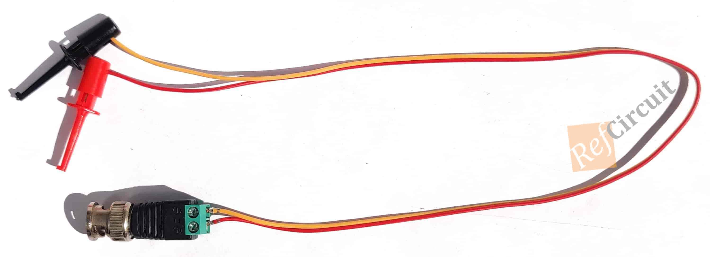
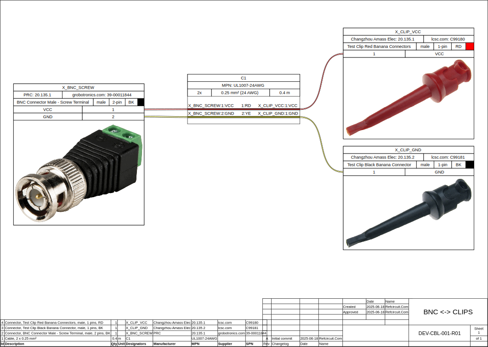

# WIREVIZ-BNC-CLIP-CABLE
* 📃 Full Article (installing and using guide): https://refcircuit.com/articles/859-how-to-make-simple-cable-drawings-using-wireviz-detailed-manual.html
___
# Dependency
1) WireWiz: https://github.com/wireviz/WireViz

# Cable Example
  
# Connection Diagram
  
